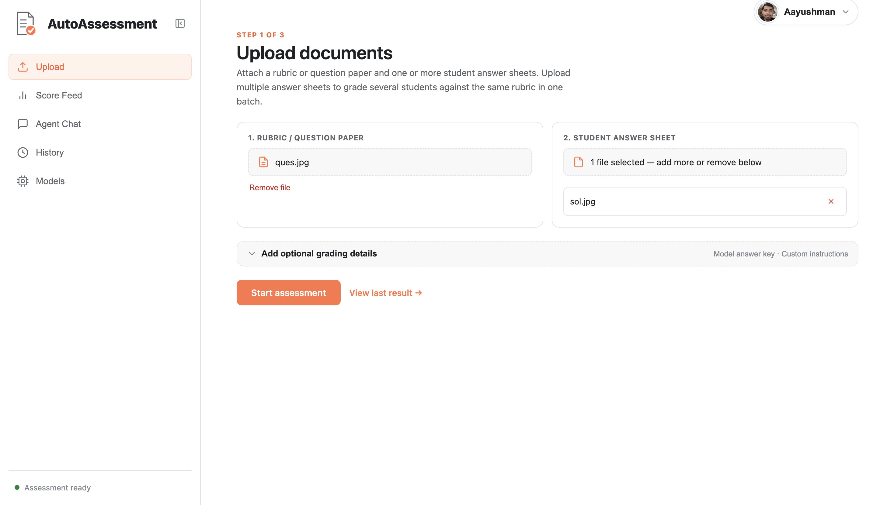
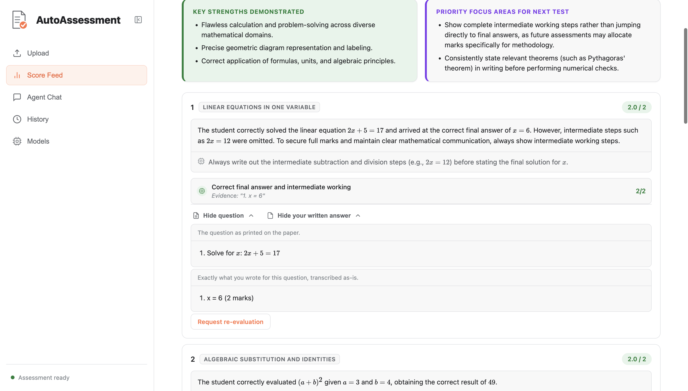
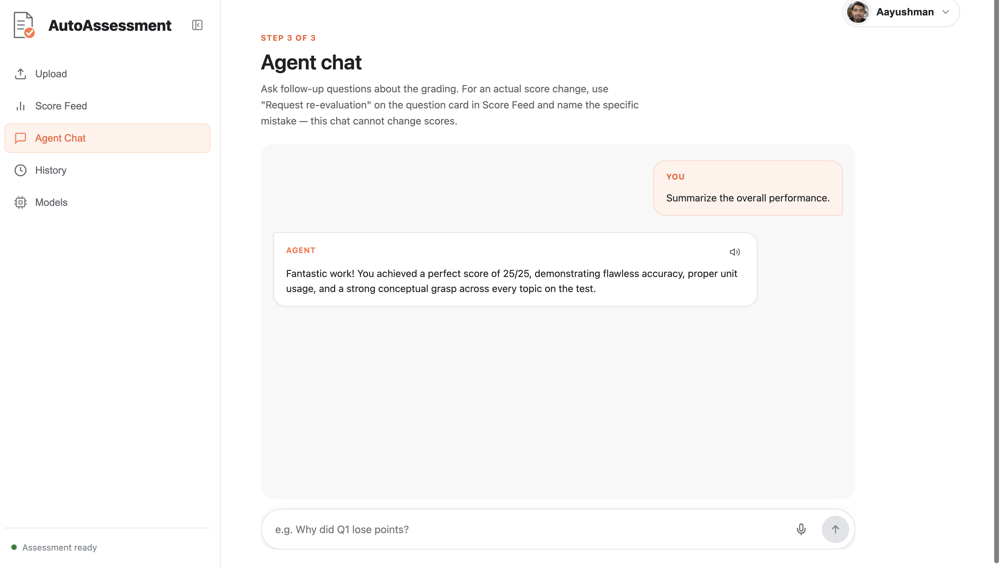

# Auto-Assessment Agent

A multi-agent, evidence-anchored rubric grading system that evaluates handwritten and typed student answer sheets against question papers and rubrics, producing question-by-question, criterion-level, and diagnostic feedback — end-to-end.

Upload a rubric/question paper and a student's answer sheet (PDF, image, or text), with an optional official model answer. The system transcribes handwritten pages, generates or aligns with a reference solution, evaluates each rubric criterion with extracted student evidence quotes, enforces deterministic score audits in Python, and provides both structured regrading and interactive follow-up chat.

<video width="100%" controls>
  <source src="run.mp4" type="video/mp4">
</video>

---

## How It Works

The grading pipeline runs as cooperating specialized agents with strict Pydantic data contracts:

| Agent / Stage | Role | Execution & Model |
|---|---|---|
| **Transcriber** | Converts handwritten/scanned PDFs and image uploads into clean, structured Markdown | `gemini-3.5-flash-lite` (Multimodal) |
| **Solver** | Generates a step-by-step master answer key (bypassed if official answer key is provided) | `gemini-3.5-flash-lite` |
| **Evaluator** | Evaluates student work against criteria, extracts verbatim evidence quotes, and generates actionable rules | `gemini-3.5-flash-lite` (Structured JSON) |
| **Auditor** | Deterministically audits arithmetic totals and score bounds in Python code | Deterministic Invariant Validator |
| **Regrade Agent** | Audits falsifiable student disputes by verifying quoted evidence against raw submissions | `gemini-3.5-flash-lite` |
| **Chat Agent** | Contextual multi-turn reasoning agent answering questions about marks and feedback | `gemini-3.5-flash-lite` |

Grading runs automatically with deterministic guardrails. Feedback is prescriptive, actionable, and rubric-defensible so students understand exactly where points were deducted and what to write on their next attempt.

---

## Repository Structure

```
auto_assessment/
├── auto_assessment/
│   ├── agent.py               # Multi-agent pipeline: Transcriber, Solver, Evaluator, Auditor, Regrade
│   ├── web.py                 # FastAPI backend exposing /api/assess, /api/regrade, /api/chat, and /api/assessments
│   ├── document_parser.py     # Ingestion & validation for raw PDFs, images, and text uploads
│   └── assessment_history.db  # SQLite database storing versioned assessment sessions
└── frontend/
    ├── src/
    │   ├── App.jsx            # Upload, Score Feed, History, and Agent Chat views
    │   └── styles.css         # Full-width fluid layout & design tokens
    ├── index.html
    └── package.json
```

---

## Frontend

The web UI is a fluid, single-page application featuring four views accessible from a persistent sidebar (and a bottom tab bar on mobile):

- **Upload** — attach the question paper/rubric and student answer sheet(s) (PDF, image, or text), plus an optional official model answer and custom grading instructions.
- **Score Feed** — growth synthesis banner (**Key Strengths** & **Priority Focus Areas**), summary metrics, and per-question cards with **Concept Tags**, **Next-Time Actionable Rules**, and verbatim student evidence quotes.
- **History** — review and reload past evaluations instantly from SQLite storage without re-uploading documents.
- **Agent Chat** — ask follow-up questions about the assessment (e.g., *"Why did Q1 lose points?"*) with an interface that dynamically expands when the sidebar is collapsed.

 



---

## Installation

```bash
pip install -r requirements.txt
```

**Required environment variable:**

```bash
export GEMINI_API_KEY="your-gemini-api-key"
```

*(Optional model configuration overrides:)*

```bash
export GEMINI_TRANSCRIPTION_MODEL="gemini-3.5-flash-lite"
export GEMINI_GRADING_MODEL="gemini-3.5-flash-lite"
export GEMINI_CHAT_MODEL="gemini-3.5-flash-lite"
```

*Note: Native PDF processing is handled directly by Gemini, removing local binary dependencies such as Poppler.*

---

## Usage

### 1. Start the FastAPI Backend

```bash
cd auto_assessment/auto_assessment
uvicorn web:app --host 0.0.0.0 --port 8000 --reload
```

The backend exposes:
- `POST /api/assess` (alias: `/evaluate`) — multipart upload for rubric, student work, and optional model answer.
- `POST /api/regrade` — structured re-evaluation of specific disputed questions with quote verification.
- `POST /api/chat` (alias: `/chat`) — contextual multi-turn conversation grounded in the active assessment.
- `GET /api/assessments/recent` — list of recent evaluations stored in the database.
- `GET /api/assessments/{assessment_id}` — fetch a specific historic evaluation.

### 2. Run the React Frontend

In a second terminal:

```bash
cd auto_assessment/frontend
npm install
npm run dev
```

Open the Vite URL shown in your terminal (typically `http://localhost:5173`). Requests to `/api` are automatically proxied to `http://127.0.0.1:8000`.

---

## API-Only Access

### Evaluate a Submission

```bash
curl -X POST "http://127.0.0.1:8000/api/assess" \
  -F "rubric_file=@examples/rubric.pdf" \
  -F "answer_file=@examples/student_answer.jpg" \
  -F "model_answer_text=Problem 1: 2x = 12, x = 6." \
  -F "instructions=Be lenient on spelling, strictly evaluate math steps"
```

### Submit a Structured Regrade Request

```bash
curl -X POST "http://127.0.0.1:8000/api/regrade" \
  -H "Content-Type: application/json" \
  -d '{
    "assessment_id": "YOUR_ASSESSMENT_UUID",
    "question_id": "Question 1",
    "claimed_mistake": "You stated I did not show step 2x = 12, but I wrote it on line 2.",
    "disputed_criterion": "Isolate variable",
    "evidence_quote": "2x = 12"
  }'
```

### Contextual Chat

```bash
curl -X POST "http://127.0.0.1:8000/api/chat" \
  -H "Content-Type: application/json" \
  -d '{
    "assessment_id": "YOUR_ASSESSMENT_UUID",
    "messages": [{"role": "user", "content": "Why did Question 1 lose points?"}]
  }'
```

---

## Key Design & Reliability Features

- **Model Answer Bypass**: When an instructor provides an official model answer, generative solution steps are bypassed to ensure evaluation strictly reflects human ground truth while reducing token cost.
- **Deterministic Invariant Auditing**: Score sums and maximum point bounds are validated in Python code by `AuditAgent` rather than relying solely on LLM self-consistency.
- **Evidence Quote Verification**: Quoted student evidence is verified against the raw submission text before any regrade score adjustments are accepted.
- **Persistent Assessment Sessions**: All grading outputs and dispute histories are persisted in SQLite, enabling multi-session review and safe concurrency.
